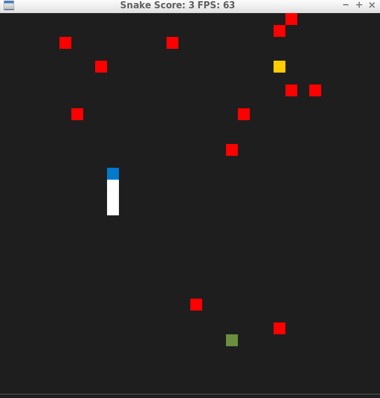
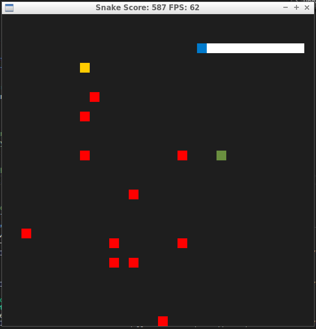

# CPPND: Capstone Snake Game Example

This is a starter repo for the Capstone project in the [Udacity C++ Nanodegree Program](https://www.udacity.com/course/c-plus-plus-nanodegree--nd213). The code for this repo was inspired by [this](https://codereview.stackexchange.com/questions/212296/snake-game-in-c-with-sdl) excellent StackOverflow post and set of responses.

The Capstone Project gives you a chance to integrate what you've learned throughout this program. This project will become an important part of your portfolio to share with current and future colleagues and employers.

In this project, you can build your own C++ application or extend this Snake game, following the principles you have learned throughout this Nanodegree Program. This project will demonstrate that you can independently create applications using a wide range of C++ features.

## Dependencies for Running Locally
* cmake >= 3.7
  * All OSes: [click here for installation instructions](https://cmake.org/install/)
* make >= 4.1 (Linux, Mac), 3.81 (Windows)
  * Linux: make is installed by default on most Linux distros
  * Mac: [install Xcode command line tools to get make](https://developer.apple.com/xcode/features/)
  * Windows: [Click here for installation instructions](http://gnuwin32.sourceforge.net/packages/make.htm)
* SDL2 >= 2.0
  * All installation instructions can be found [here](https://wiki.libsdl.org/Installation)
  >Note that for Linux, an `apt` or `apt-get` installation is preferred to building from source. 
* gcc/g++ >= 5.4
  * Linux: gcc / g++ is installed by default on most Linux distros
  * Mac: same deal as make - [install Xcode command line tools](https://developer.apple.com/xcode/features/)
  * Windows: recommend using [MinGW](http://www.mingw.org/)

## Basic Build Instructions

1. Clone this repo.
2. Make a build directory in the top level directory: `mkdir build && cd build`
3. Compile: `cmake .. && make`
4. Run it: `./SnakeGame`.

## Additional Features added to this project 
As a part of this Udactiy's C++ capstone project the snake game has been extended with 2 additional features:
1. SuperFood - which is rendered as a green square object in the SDL window
2. Poisons - which are rendered as red square objects in the SDL window

The legacy "food" is maintained as such with the yellow square object in the SDL window. Consuming it, increases the score by one unit and the snake at a constant medium speed that is set in this game. 

If the SuperFood is consumed, it increases the snake's speed to a constant maximum reachable speed that is set in the game and it also doubles the score.It re-appears randomly on the screen between a interval of 4s to 10s.
Apart from this, there are 12 poisons placed in the screen at the start of the game.If a poison a consumed the snake size is reduced by one unit and the score is decremented by 1 unit as well. In addition to this, the snake's speed is reduced to a constant minimum reachable speed that is set in the game. A new poison will be replaced in the screen at a random position to compensate for the consumed one.

In case, if the snake has not yet developed a body and only the head is present and if it consumes two poisons consecutively, then the snake dies and the game is over. Then all the game features are cleared off from the screen and in the title the final score is displayed.
Also, the game ends if the snake bites itself.

The following requirements were implemented based on the concepts learned from this C++ course : 

**Loops Functions, OOP**
The newly added files "gamefeatures.h" and "gamefeatures.cpp" were newly added addresses the below points: 
	1. A variety of control structures are added to the project
	2. The project code is clearly organized into functions.
     (Also two new functions were added : Game::PlaceSuperFood(), Game::PlacePoisons() to address the above point)
  3. The project uses vectors and uses constant variables.
  4. One or more classes are added to the project with appropriate access specifiers for class members.
  5. Class constructors utilize member initialization lists.
  6. Classes follow an appropriate inheritance hierarchy with virtual and override functions.
  7. Classes abstract implementation details from their interfaces.
  8. The project makes use of references in function declarations.
 
 **Memory Management**
 The newly added features of "superFood" and "poisons" present in "game.h" and "game.cpp" addresses the below points:
  1. The project uses scope / Resource Acquisition Is Initialization (RAII) where appropriate.
  2. The project uses smart pointers instead of raw pointers.
 The Game::~Game() desctuctor is for setting up thread barrier
  1. The project uses destructors appropriately.

**Concurrency**
 The newly added function "Game::PlaceSuperFood()" addresses the following points:
  1. The project uses multithreading.
  2. A mutex or lock is used in the project.

## CC Attribution-ShareAlike 4.0 International

Shield: [![CC BY-SA 4.0][cc-by-sa-shield]][cc-by-sa]

This work is licensed under a
[Creative Commons Attribution-ShareAlike 4.0 International License][cc-by-sa].

[![CC BY-SA 4.0][cc-by-sa-image]][cc-by-sa]

[cc-by-sa]: http://creativecommons.org/licenses/by-sa/4.0/
[cc-by-sa-image]: https://licensebuttons.net/l/by-sa/4.0/88x31.png
[cc-by-sa-shield]: https://img.shields.io/badge/License-CC%20BY--SA%204.0-lightgrey.svg
